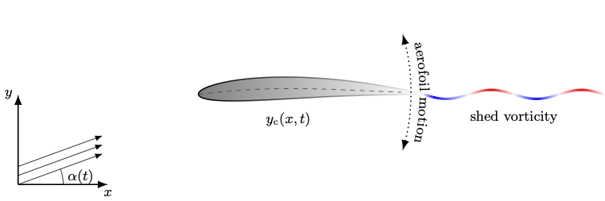
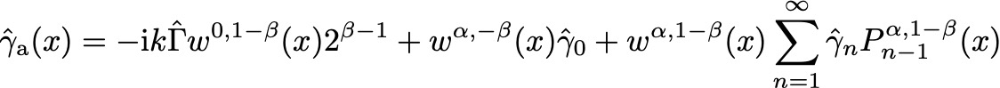

# Unsteady porous aerofoils

This repository contains the codes used to generate the results in the paper
["Unsteady aerodynamics of porous aerofoils"](https://www.cambridge.org/core/journals/journal-of-fluid-mechanics/article/abs/unsteady-aerodynamics-of-porous-aerofoils/9F7A28838D1EEB585B73E127164DCBA5) by Baddoo, Hajian and Jaworski in the Journal of Fluid Mechanics.

The paper is concerned with the vorticity distribution produced by a porous aerofoil executing unsteady motions in an inviscid fluid.
In the thin-aerofoil approximation, the aerofoil can be modelled as an infinitesimally thin sheet and the vorticity distribution satsfies 
a singular integral equation (SIE).
Asymptotic analysis at the endpoints of the SIE reveals that the vorticity distribution possesses a singularity there and the form of 
the singularity can, to leading order, be expressed as a function of the material properties of the porous medium.
Balancing the singularities in the SIE suggests that the vorticity distribution can be expanded as a series of weighted Jacobi polynomials:

The coefficients of the weighted Jacobi polynomials are then determined via collocation.

You can get started by running "example.m" in the examples folder.
That will best explain the structure of the code and how you enter the various parameters.
Here's an explanation of the main files:

File name | Function
------------ | -------------
calculateUnsteadyCoefficients.m | Calculates the coefficients of the Jacobi expansion for a given porosity distribution, aerofoil motion and frequency. This is really the main function.
calculateUnsteadyCoefficientsDiscont.m | Calculates the coefficients of the Jacobi expansion in the special case where the porosity distribution is discontinuous.
presFun.m | Calculates the pressure at the given points along the chord.
vortFun.m | Calculates the vorticity at the given points along the chord.
vortInt.m | Calculates the indefinite integral of the vorticity at the given points along the chord.
lift.m | Calculates the lift for a set of coefficients and frequency.
circulation.m | Calculates the circulation for a set of coefficients and frequency.
myJacobiP.m | Calculates the Jacobi polynomials using the recurrence relation.
myJacobiQ2.m | Calculates the Hilbert transform of the weighted Jacobi polynomials.
myJacobiI.m | Calculates the indefinite integral of the weighted Jacobi polynomials.
myBeta.m | My version of the incomplete Beta function that extends the domain of definition. Note that this uses the symbolic math toolbox. 
presFUnsteady.m | Computes the pressure on the forward part of an aerofoil with a discontinuous porosity distribution.
presAUnsteady.m | Computes the pressure on the aft part of an aerofoil with a discontinuous porosity distribution.
vortFUnsteady.m | Computes the vorticity on the forward part of an aerofoil with a discontinuous porosity distribution.
vortAUnsteady.m | Computes the vorticity on the aft part of an aerofoil with a discontinuous porosity distribution.

If you encounter any issues then feel free to get in touch with me at [baddoo@mit.edu](baddoo@mit.edu).
