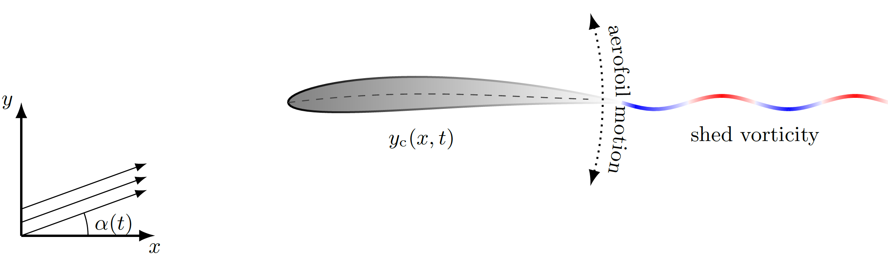

# Unsteady porous aerofoils

This repository contains the codes used to generate the results in the paper
["Unsteady aerodynamics of porous aerofoils"](https://www.cambridge.org/core/journals/journal-of-fluid-mechanics/article/abs/unsteady-aerodynamics-of-porous-aerofoils/9F7A28838D1EEB585B73E127164DCBA5) by Baddoo, Hajian and Jaworski.

The paper is concerned with the vorticity distribution produced by a porous aerofoils executing unsteady motions in an inviscid fluid.
In the thin-aerofoil approximation, the aerofoil can be modelled as an infinitesimally thin sheet and the vorticity distribution satsfies 
a singular integral equation (SIE).
Asymptotic analysis at the endpoints of the SIE reveals that the vorticity distribution possesses a singularity there and the form of 
the singularity can, to leading order, be expressed as a function of the material properties of the porous medium.
Balancing the singularities in the SIE suggests that the vorticity distribution can be expanded as a series of weighted Jacobi polynomials:

The coefficients of the weighted Jacobi polynomials are then determined via collocation.

If you encounter any issues then feel free to get in touch with me at [baddoo@mit.edu](baddoo@mit.edu).
